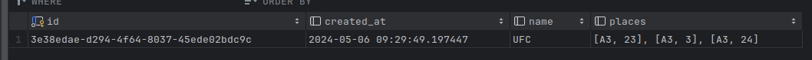

# Ticket Demo Application

This application allow to see a minimum configuration for a websocket application in
a [clean architecture](https://herbertograca.com/2017/11/16/explicit-architecture-01-ddd-hexagonal-onion-clean-cqrs-how-i-put-it-all-together/).

## required

You must pull latest postgres docker image

``docker pull postgres``

Then run [launch-postgres.sh](launch-postgres.sh) with start paramter

``./launch-postgres.sh start``

Finally, you could run your springboot application as usual.

## DataBase properties

Get the host, port, username and password directly
in [application.properties](src%2Fmain%2Fresources%2Fapplication.properties).

## Register Places for Events

### Endpoint:

- **URL:** `POST http://localhost:8080/events/place/register`
- **Description:** This endpoint is used to register places for events.
- **Body Parameters:**
    - `name` (String): The name of the event.
    - `bookedPlaces` (List of Place objects): A list of places reserved for the event.
        - `rank` (String): The rank of the place.
        - `seatNumber` (int): The seat number of the place.

#### Example Request Body:

```json
{
  "name": "EventName",
  "bookedPlaces": [
    {
      "rank": "A",
      "seatNumber": 1
    },
    {
      "rank": "B",
      "seatNumber": 2
    }
  ]
}
```

# Connect to websocket app

Your web application will connect to the following url `'ws://localhost:8080/ticket'` with a websocket client, then you
must subscribe to `/topic/bookedPlaces`.

here an example in javascript:

```
const socket = new WebSocket('ws://localhost:8080/ticket');

socket.onopen = () => {
  console.log('WebSocket connection established.');
  
  socket.send(JSON.stringify({
    type: 'subscribe',
    destination: '/topic/bookedPlaces'
  }));
};

socket.onmessage = (event) => {
  console.log('Received message:', event.data);
   // use the data here to link to your web page
};

socket.onclose = () => {
  console.log('WebSocket connection closed.');
};
```

# History

A request history is persisted in the database

